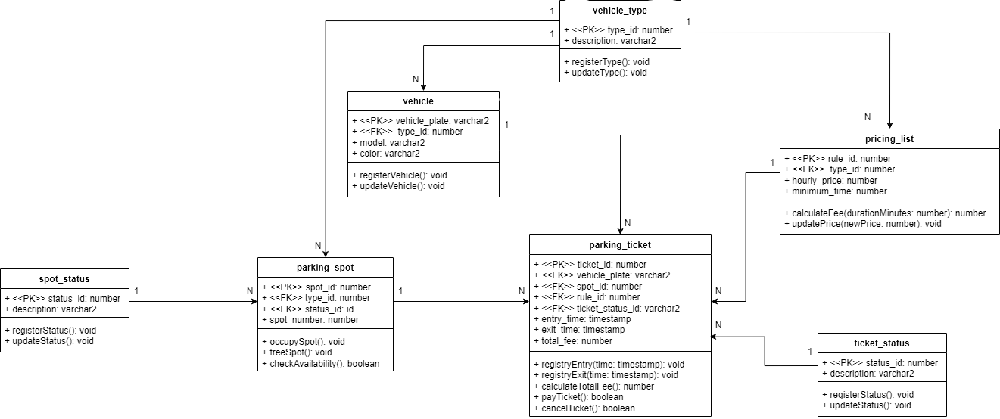

> [!NOTE]
🇧🇷 **Para a versão em Português**, [clique aqui](#pt)

# Full-Stack Application: Java, TypeScript & Oracle PL/SQL

## About the Project
This repository contains a complete full-stack project demonstrating the integration between a modern web frontend (vibecoded), a robust Java backend, and an Oracle database. The main focus is to show how business logic can be distributed and managed across different layers of an application, especially using PL/SQL Packages.

## Technologies Used
* **Frontend:** HTML5, CSS3, JavaScript, TypeScript
* **Backend:** Java
* **Database:** Oracle Database (SQL & PL/SQL)

## Architecture & Features
* **Frontend Layer:** Built with TypeScript and HTML/CSS to provide a responsive and typed user interface. It communicates with the backend via REST/HTTP requests.
* **Backend Layer (Java):** Acts as the bridge between the user interface and the database. It handles API requests, processes basic logic, and calls the database routines.
* **Database Layer (Oracle PL/SQL):** * **Packages (`employeePackage`):** Demonstrates the split between Package Specification (public contract) and Package Body (private logic).
  * **Triggers:** DML triggers for audit logging (`schema_audit`) and `INSTEAD OF` triggers for complex View manipulation.
  * **Views:** Abstraction of complex queries into virtual tables.

## How to Run
1. **Database:** Open your Oracle SQL environment, run the table creation scripts, and compile the Packages (`Specification` and `Body`).
2. **Backend:** Run the Java application to start the API server. Ensure the database connection string is properly configured.
3. **Frontend:** Open the frontend directory and run the application (e.g., using a local server) to interact with the UI.

---

> [!NOTE]
🇺🇸 **For the English version**, [click here](#en)

# Aplicação Full-Stack: Java, TypeScript & Oracle PL/SQL

## Sobre o Projeto
Este repositório contém um projeto full-stack completo demonstrando a integração entre um frontend web (vibecoded), um backend robusto em Java e um banco de dados Oracle. O foco principal é mostrar como a lógica de negócio pode ser distribuída e gerenciada nas diferentes camadas de um sistema, especialmente usando Pacotes PL/SQL.

## Tecnologias Utilizadas
* **Frontend:** HTML5, CSS3, JavaScript, TypeScript
* **Backend:** Java
* **Banco de Dados:** Oracle Database (SQL & PL/SQL)

## Arquitetura e Funcionalidades
* **Camada de Frontend:** Construída com TypeScript e HTML/CSS para fornecer uma interface de usuário responsiva e tipada. Comunica-se com o backend através de requisições REST/HTTP.
* **Camada de Backend (Java):** Atua como a ponte entre a interface do usuário e o banco de dados. Recebe as requisições, processa regras intermediárias e aciona as rotinas do banco.
* **Camada de Banco de Dados (Oracle PL/SQL):**
  * **Pacotes (`employeePackage`):** Demonstra a divisão entre o Package Specification (contrato público) e o Package Body (lógica privada).
  * **Triggers (Gatilhos):** Triggers DML para auditoria de dados (`schema_audit`) e Triggers `INSTEAD OF` para manipulação de Views complexas.
  * **Views:** Abstração de consultas complexas em tabelas virtuais.

## Como Executar
1. **Banco de Dados:** Abra seu ambiente Oracle SQL, rode os scripts de criação de tabelas e compile os Pacotes (`Specification` e `Body`).
2. **Backend:** Inicie a aplicação Java para subir o servidor da API. Certifique-se de que a string de conexão com o banco está configurada corretamente.
3. **Frontend:** Abra o diretório do frontend e inicie a aplicação (ex: usando um servidor local) para interagir com a interface.
